# `wireshark`应用


## `wireshark`视图以及各个字段说明


###  分析包的详细信息

后期会通过到处文本的方式进行注释，前期先使用图片，这样容易用颜色区分

在包的详细信息界面一般如下：


**`Frame`**

物理层的数据帧概况，如果图片太小可以去`github`上下载对应的图片查看


**`Ethernet II`**

数据链路层以太网帧头部信息


**`Internet Protocol Version 4`**

互联网层`IP`头部信息


**`Transmission Control Protocol`**

传输层的数据段头部信息，此处为`TCP`协议


**`File Transfer Protocol`**

应用层头部信息，此处为`FTP`协议

应用层协议，每个都不一样，需要参考对应的协议`RFC`文档。

### 数据包事件延迟

时间延迟通常有三种类型，线路延迟、客户端延迟和服务器延迟。

**线路延迟**

线路延迟通常被称为往返时间`RTT`延迟。当服务器收到一个`SYN`数据包时，由于不涉及任何传输层以上的处理，发送一个相应延迟至需要非常小的处理量，即使服务器承受巨大的负载，通常也会迅速的向`SYN`数据包响应一个`SYN/ACK`，这样就可以排除服务器导致的高延迟的可能性。同时也可以排除客户端的高延迟的可能性，因为它基本上除了接收`SYN/ACK`以外什么也没有做，这样就可以确认是线路延迟。

`wireshark`中可以通过看`TCP`的三次握手来确认是线路延迟。

**客户端延迟**

客户端延迟通常是由于用户、应用程序缺乏足够的资源造成的。

**服务端的延迟**

服务器延迟发送在，服务器缓慢相应发送过来的请求时，这可能是因为服务器无法处理一个错误应用程序或受其他干扰


图中，002表示的是线路延迟，数字004是客户端延迟，数字006是服务器延迟

延时分析实战：

使用`wireshark`开始抓包，并访问国外的网站，如`github`等，抓包之后我们进行分析，将时间选择为自上一个捕获分组经过的秒数

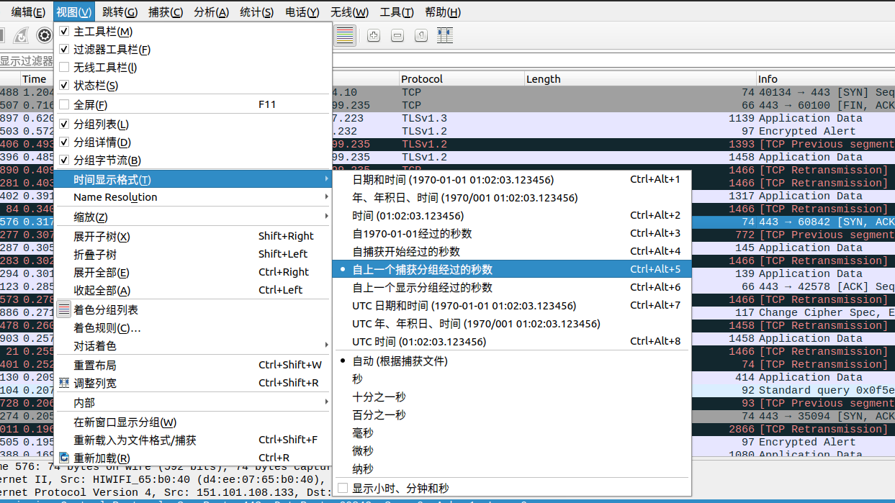

配置完成之后双击`time`列，将间隔时间按照倒叙进行排序，然后找到`SYN/ACK`时间延时比较长的列，对其进行追溯，可以看到图中`SYN/ACK`至接收`SYN`花费了较久的时间，因为网络环境限制，没有主导比较完美的`SYN -> SYN,ACK->ACK`的过程，但是从`SYN/ACK`的延时上已经可以确认网络路径上的延时是比较大的。


### 捕获特定的`ICMP`数据

互联网控制消息协议`ICMP`是一种协议，当一个网络中出现性能或者安全问题时，将会看到该协议。

`ICMP`常用的捕获过滤器的结构

- `icmp`：捕获所有的`ICMP`数据包
- `icmp[0]=8`：捕获所有的`ICMP`字段类型为8(`Echo Request`)的数据包。
- `icmp[0]=17`：捕获所有`ICMP`字段类型为17(`Adress Mask Request`)的数据包
- `icmp[0]=8 or icmp[0]=0`：捕获所有`ICMP`字段类型为8或者`ICMP`字段为0(`Echo Replay`)的数据包
- `icmp[0]=3 and not icmp[1]=4`：捕获所有`ICMP`字段类型为3(`Destination Unreachable`)的包，除了`ICMP`字段类型为3代码为4（`Fragmentation Needed and Don't Fragment was set`）的数据包

使用`wireshark`最令人苦恼的就属那令人头疼的设置过滤条件了，老是记不住怎么办，其实设计`wireshark`的大佬已经留了后门，或者说是留了获取对应过滤设置的方法获取的方式

你想要过滤哪些内容，只需要将箭头点击相同协议的展开行，在左下角就会显示出对应字段的过滤器写法，只需要按照对应写法设置就可以过滤你想要的对应数据了

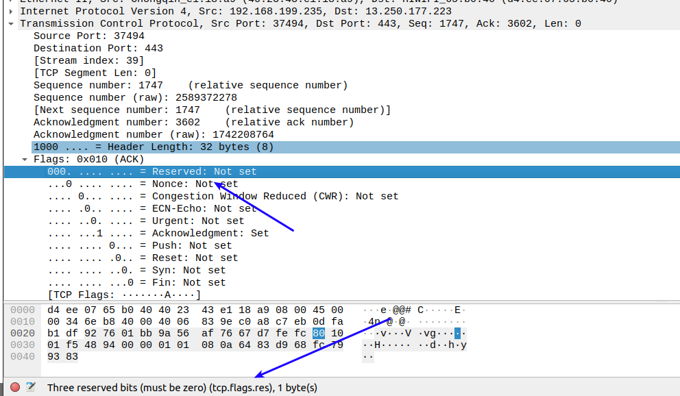


### 过滤单一的对话

想单独跟踪一个单一的`TCP`或者其他的会话，可以使用对话过滤器

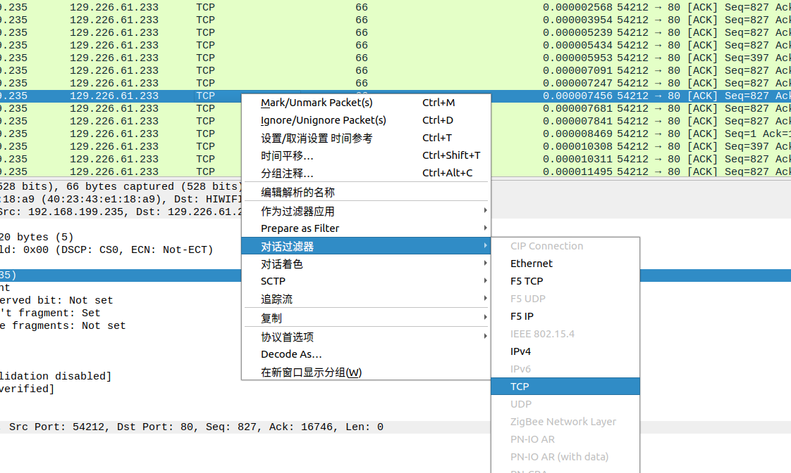


### 图表化显示宽带使用情况

**初识`IO Graph`**

统计--> `IO 图表`

统计出来默认的是全部的数据，要是想看那个具体的协议的数据情况，可以关掉图表之后再

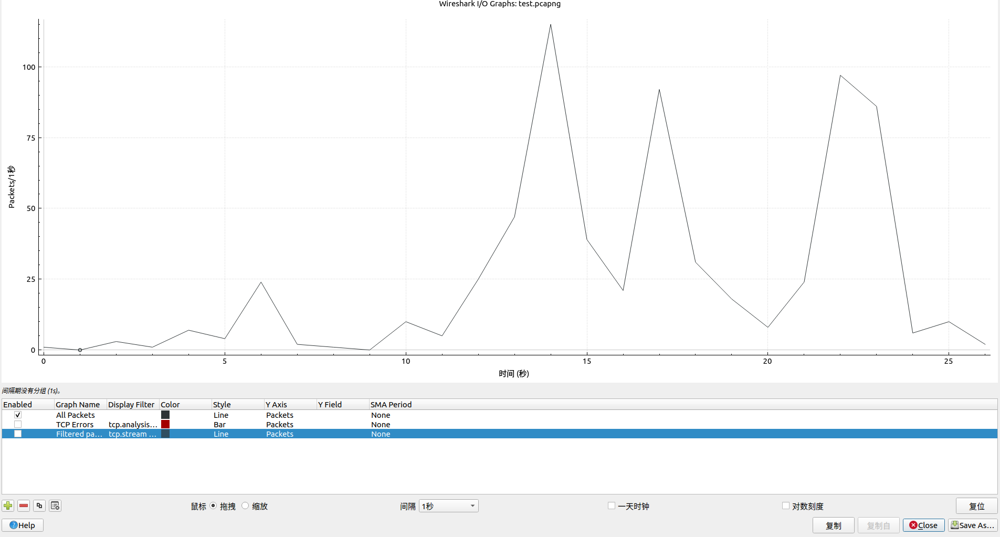

在过滤器中输入要过滤的内容，回车之后再打开`IO`图表


再次打开`IO`图表之后，就会自动添加相应的过滤内容，好了现在可以查看你想要的内容和所有数据或者其他数据的`IO`图形对比情况了

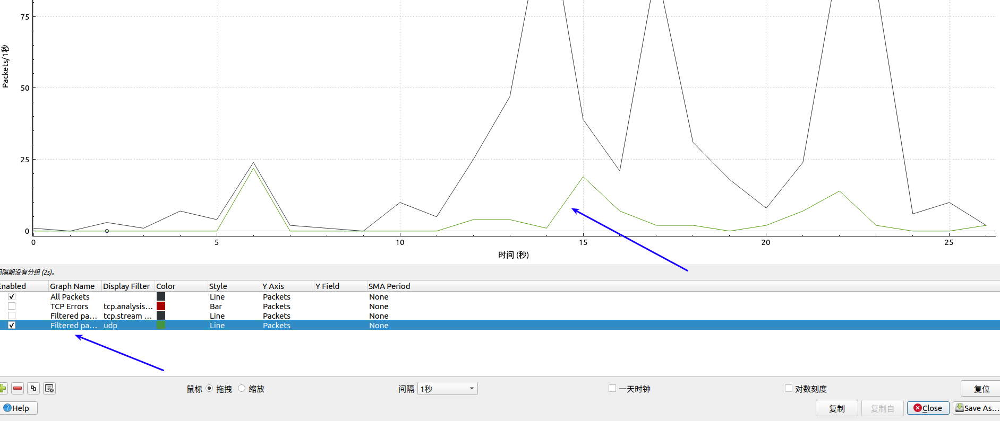


### 文件重组--文件还原

`wireshark`能将抓包中的数据进行还原，比如在`HTTP`上下载一个图片，可以采用以下步骤将其从数据中还原出来

首先在编辑->协议->`TCP`确认开启了`Allow subdisserctor to reassemble TCP streams`

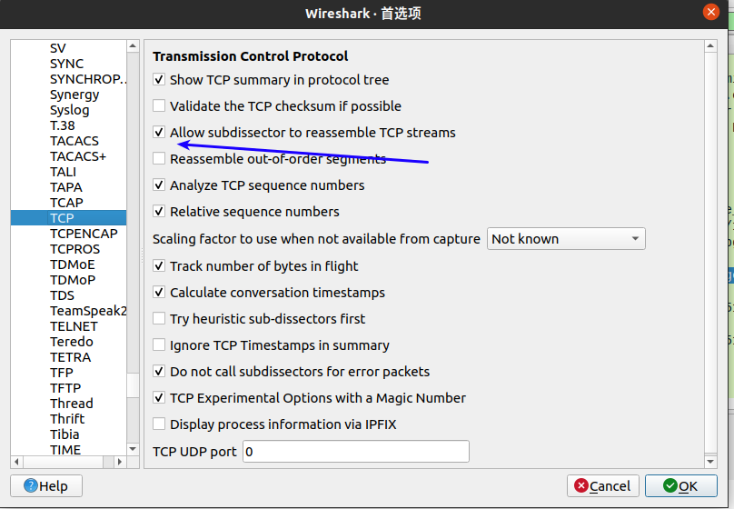

，过滤`HTTP`


然后随该数据进行追踪`HTTP`流。

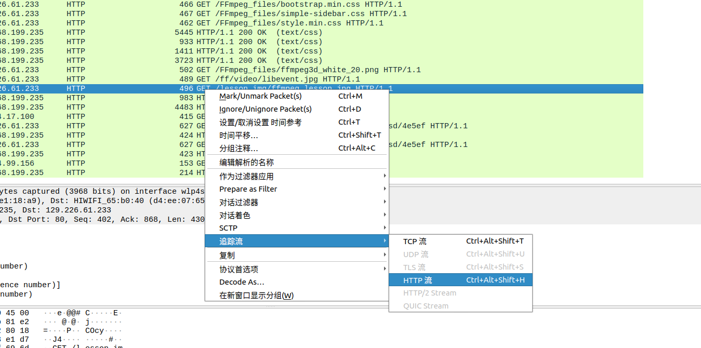

然后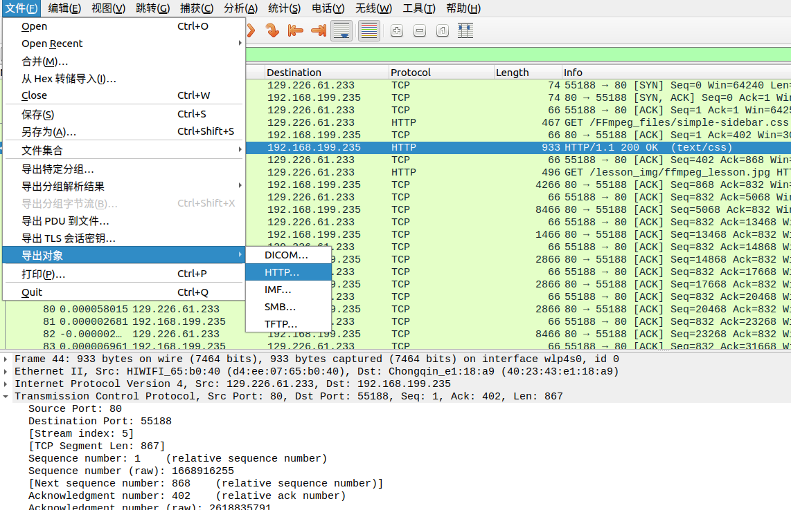

选择对应的图片，然后点击保存；

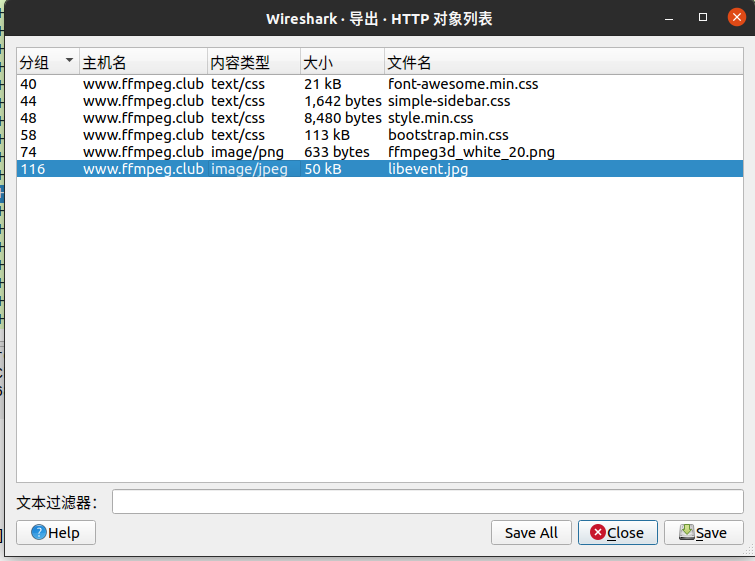


### 添加注释

如果你的文件是`.pcap`结尾的，那么注释添加之后一定要用`.pcapng`结尾保存，因为`.pcap`结尾的文件将会丢弃一起的注释信息。

- 包注释

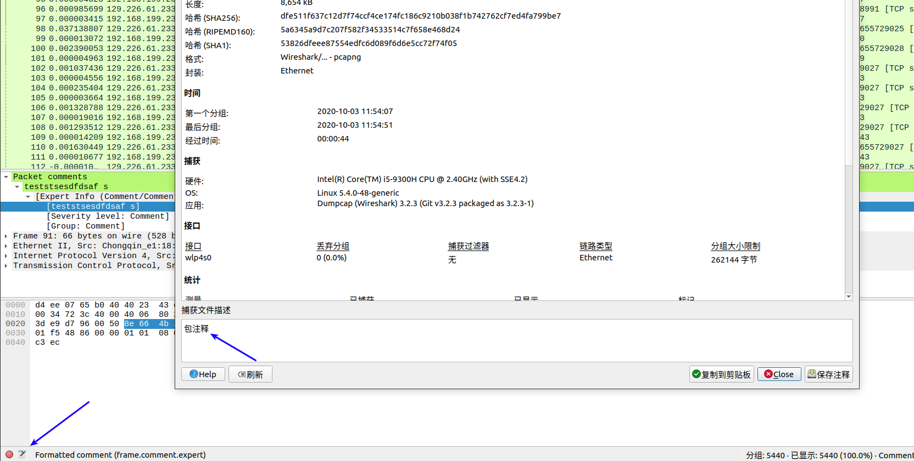

- 分组注释

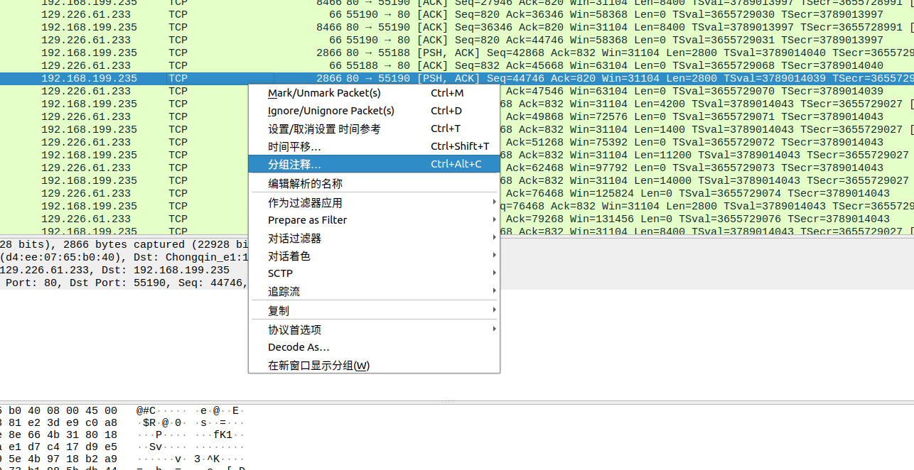

通过统计信息查看注释

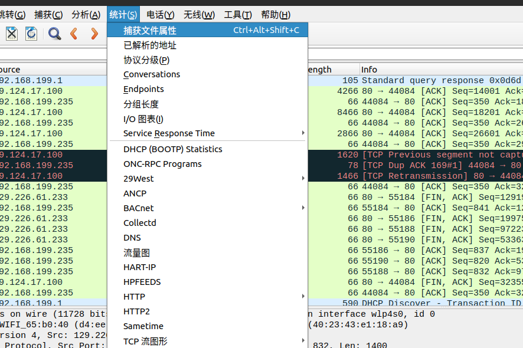

通过专家信息查看注释

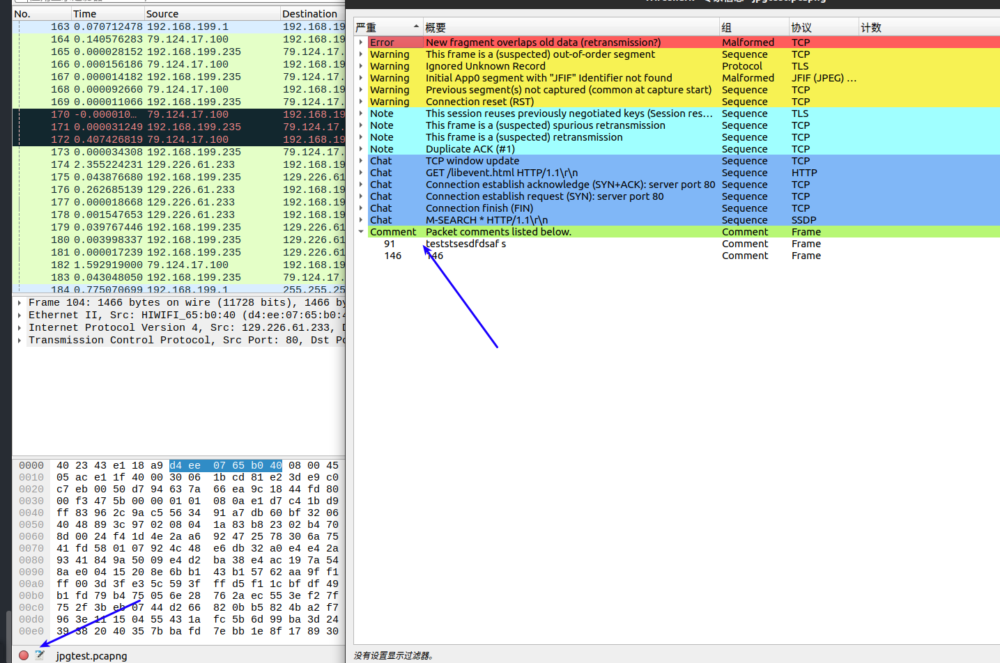


**到处有注释的分组信息**

首先使用`pkt_comment`对包进行过滤，过滤出来的都是有分组注释信息的包，然后再按照纯文本导出对应的注释文件信息

### 文件分割与合并

`wireshark`的包文件可以使用`capinfos`查看具体信息，查看之后包比较大的可以使用`editcap`命令进行分割

使用`capinfos`命令查看包信息

```bash
andrew@andrew-G3-3590:~/文档$ capinfos test.pcapng 
File name:           test.pcapng
File type:           Wireshark/... - pcapng
File encapsulation:  Ethernet
File timestamp precision:  nanoseconds (9)
Packet size limit:   file hdr: (not set)
Number of packets:   679
File size:           502 kB
Data size:           479 kB
Capture duration:    26.943556678 seconds
First packet time:   2020-10-02 18:51:08.113739462
Last packet time:    2020-10-02 18:51:35.057296140
Data byte rate:      17 kBps
Data bit rate:       142 kbps
Average packet size: 705.63 bytes
Average packet rate: 25 packets/s
SHA256:              e502d66dfda84fffb3bc103ba0e7f2a0d8eddbedbce60e0d203d0e0fe6770586
RIPEMD160:           87aa7b636d4b649ce0653eccc2da44750df23c09
SHA1:                4a1c206d0590b72e2fe24fd0fde4ce5ab19c4879
Strict time order:   True
Capture hardware:    Intel(R) Core(TM) i5-9300H CPU @ 2.40GHz (with SSE4.2)
Capture oper-sys:    Linux 5.4.0-48-generic
Capture application: Dumpcap (Wireshark) 3.2.3 (Git v3.2.3 packaged as 3.2.3-1)
Number of interfaces in file: 1
Interface #0 info:
                     Name = wlp4s0
                     Encapsulation = Ethernet (1 - ether)
                     Capture length = 262144
                     Time precision = nanoseconds (9)
                     Time ticks per second = 1000000000
                     Time resolution = 0x09
                     Operating system = Linux 5.4.0-48-generic
                     Number of stat entries = 1
                     Number of packets = 679
```

使用`editcap`进行包分割


`-c 100`的意思就是每个包的大小最大为`100`

按照时间间隔进行分割，每360s分割成一个包

`editcap -i 360 test.pcapng timeset.pcapng`

合并多个分割的数据包使用`mergecap`命令，合并过后的包，会打上合并包的标记

```bash
andrew@andrew-G3-3590:~/文档/test$ ls
alias_test_00000_20201002185108  alias_test_00003_20201002185124  alias_test_00006_20201002185131
alias_test_00001_20201002185121  alias_test_00004_20201002185126  test.pcapng
alias_test_00002_20201002185122  alias_test_00005_20201002185130
andrew@andrew-G3-3590:~/文档/test$ rm test.pcapng 
andrew@andrew-G3-3590:~/文档/test$ ls
alias_test_00000_20201002185108  alias_test_00003_20201002185124  alias_test_00006_20201002185131
alias_test_00001_20201002185121  alias_test_00004_20201002185126
alias_test_00002_20201002185122  alias_test_00005_20201002185130
andrew@andrew-G3-3590:~/文档/test$ mergecap -w test.pcapng alias_test_0000*
andrew@andrew-G3-3590:~/文档/test$ capinfos test.pcapng 
File name:           test.pcapng
File type:           Wireshark/... - pcapng
File encapsulation:  Ethernet
File timestamp precision:  nanoseconds (9)
Packet size limit:   file hdr: (not set)
Number of packets:   679
File size:           502 kB
Data size:           479 kB
Capture duration:    26.943556678 seconds
First packet time:   2020-10-02 18:51:08.113739462
Last packet time:    2020-10-02 18:51:35.057296140
Data byte rate:      17 kBps
Data bit rate:       142 kbps
Average packet size: 705.63 bytes
Average packet rate: 25 packets/s
SHA256:              724d9a493a687365975ba128a87683e3f57ca1d27d30698f3e3f18bfe81c98d9
RIPEMD160:           0337eef64949160c16a7804c26c64177014f6ff6
SHA1:                e373b626928c1b27413442b956fe3a5c4174cc4c
Strict time order:   True
Capture oper-sys:    Linux 5.4.0-48-generic
Capture application: Mergecap (Wireshark) 3.2.3 (Git v3.2.3 packaged as 3.2.3-1)
Number of interfaces in file: 1
Interface #0 info:
                     Name = wlp4s0
                     Encapsulation = Ethernet (1 - ether)
                     Capture length = 262144
                     Time precision = nanoseconds (9)
                     Time ticks per second = 1000000000
                     Time resolution = 0x09
                     Operating system = Linux 5.4.0-48-generic
                     Number of stat entries = 0
                     Number of packets = 679

```


[博客地址](https://blog.csdn.net/andrewgithub/article/details/108909547)


