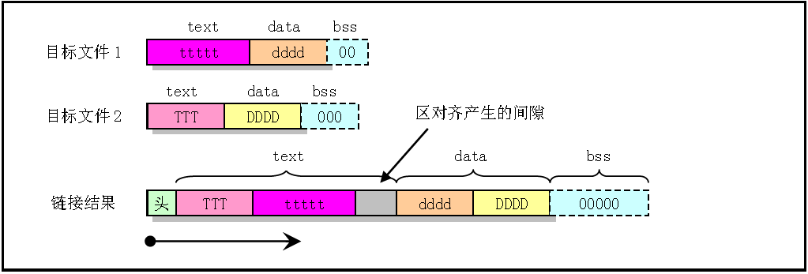

# GNU as汇编

在编译C语言程序时，`GNU` `gcc`编译器会首先输出一个作为中间结果的`as`汇编语言文件，然后`gcc`回调用`as`汇编器把这个临时汇编语言程序编译成目标文件。即实际上`as`汇编器最初是用于专门汇编`gcc`产生的中间汇编语言程序的，而非作为一个独立的汇编器使用(这也就是为什么你只调用`gcc`就能将你的`c`语言代码编译成可执行文件，因为在需要的时候`gcc`会调用汇编器的)。


## 编译`as`汇编语言程序

使用`as`汇编器编译一个`as`汇编语言程序的基本命令行格式如下：

```bash
as [option] [-o objfile] [srcfile.s]
```


## `as`汇编语法

为了维持与`gcc`输出汇编程序的兼容性，`as`汇编器使用`AT&T`系统`V`的汇编语法。这种语法与`Intel`汇编程序使用的语法很不一样，他们之间主要的区别有以下几点：

- `AT&T`语法中立即操作数前面要加一个字符`$`；寄存器操作数前要加上百分号`%`；绝对跳转`/`调用操作数前面要加上星号`*`。而`Intel`汇编语法均没有这些限制
- `AT&T`语法与`Intel`语法使用的源和目的操作数次序正好相反，`AT&T`的源和目的操作数是从左到右;源， 目的；`add eax, 4`
- `AT&T`语法中内存操作数的长度由操作码最后一位字符来确定。前缀 'b'、'w'和'l'分别指示内存引用宽度为 8位字节（ 位字节（ 位字节（ byte byte）、16 位字（ 位字（ word ）和 32 位长字（ 位长字（ 位长字（ long long ）。 `Intel`语法则通过在内存操作数前使用缀` 'byte prt'、'word ptr'和'dword ptr'`来达到同样目的。

- `AT&T`语法中立即形式跳转和远调用为`ljmp/lcall $section, $offset`，而`Intel`的是`jmp/call far section:offset`。同样`AT&T`语法中的远返回指令`lret $stack-adjust`对应`Intel`的`ret far stack-adjust`.
- `AT&T`汇编器不提供对多段代码程序的支持，`UNIX`类操作系统要求所有代码在一个段中。


## 汇编器预处理

`as`汇编器会对汇编语言进行简单的预处理，该预处理功能会调整并删除多余的 空格字符和制表符；删除所有注释语句并且使用单个空格或者一些换行符替换它们；把字符常数转换为对应的数值。但是该预处理功能不会对宏定义进行处理，也没有处理包含文件的功能。如果需要这方面的功能，那么就可以让汇编语言程序使用大写的后缀`.S`让`as`使用`gcc`的`CPP`预处理功能。

由于`as`汇编语言程序除了使用`C`语言注释语句以外，还使用井号`#`作为单行注释开始字符，因此若在汇编之前不对程序执行预处理，那么程序中包含的所有以`#`开始的指示符或者命令均会被当成注释部分。


## 符号、语句和常数

符号是由字符组成的标识符，组成符号的有效字符取自于大小写字符集、数字和三个字符`_.$`，符号不允许用数字开始，并且大小写含义不同。

语句以换行符或者分隔符`;`作为结束，文件最后语句必须以换行符作为结束，若是在一行的最后使用反斜杠`\`表示这一条语句使用多行。当`as`读取到反斜杠加换行符时，就会忽略掉这两个字符。

语句由零个或多个标号开始，后面可以跟随一个确定类型的关键符号。标号由符号后面跟随一个冒号构成，关键符号确定了语句余下部分的语义。如果该关键符号以一个`.`开始，那么当前语句就是一个汇编命令（或者称为伪指令、指示符）。如果关进符号以一个字母开始，那么当前语句就是一条汇编指令语句。因此一条语句的通用格式为：

---

标号 ： 汇编命令     注释部分

标号： 指令助记符 操作数1 操作数2    注释部分

---

常数是一个数字，可分为字符常数和数字常数两类。字符常数还可以分为字符串好单个字符，而数字常数可分为整数、大数和浮点数。


## 指令语句、操作数和寻址

指令是`CPU`执行的操作，通常指令也称为操作码；操作数是指令操作的对象；而地址是指定数据在内存中的位置。指令语句是程序运行时刻执行的一条语句。

- 标号（可选）；
- 操作码（指令助记符）；
- 操作数（由具体指令指定）；
- 注释

一条指令语句可以含有0个或者最多3个用逗号分开的操作数，对于具有两个操作数的指令语句第一个是源操作数第二个是目的操作数；

操作数可以是立即数、寄存器或内存。

- 立即操作数前要加上一个`$`字符前缀
- 寄存器名前要加上一个`%`字符前缀
- 内存操作数由变量名或者含有变量地址的寄存器指定。


## 区与重定位

区（也称为段、节或部分）用于表示一个地址范围，操作系统将会以相同的方式对待和处理在该地址范围中的数据信息。例如可以有一个只读的区，我们只能从该区中读取数据而不能写入。

连接器`ld`会把输入的目标文件中的内容按照一定规律组合成一个可执行程序。当`as`汇编器输出一个目标文件时，该目标文件中的代码被默设置成从0开始。此后`ld`将会在链接的过程中为不同的目标文件中的各个部分分配不同的最终地址位置。`ld`会把程序中的字节块移动到程序运行时的地址处。这些块是作为固定单元进行移动的。他们的长度以及字节次序都不会被改变，这样固定的单元就被称作区。而为区分配运行时刻的地址的操作就被称为重定位操作，其中包括调整目标文件中记录的地址，从而让它们对应到恰当的运行时刻地址上。

`as`汇编器输出的目标文件中至少具有3个区，分别称为正文(text)、数据(data)、和`bss`区。每个区都可能是空的，如果没有使用汇编命令将输出放置在`.text`或者`.data`区中，这些区会依然存在，但是内容是空的。在一个目标文件中，`text`区从地址0开始，随后是`data`区，再后面是`bss`区。

## 链接器涉及的区

链接器`ld`只涉及如下4类区：

- `text`区、`data`区--这两个区用于保存程序。`as`和`ld`会分别独立而同等地对待他它们。对其中`text`区的描述也同样适合于`data`区。然而当程序运行时，通常`text`区是不会改变的。`text`区通常会被进程共享，其中含有指令代码和常数等内容。程序运行时`data`区的内容通常是会变化的，例如C变量一般就存放在`data`区中。
- `bss`区--在程序开始运行时这个区中含有0值字节。该区用于存放未初始化的变量或作为i公共变量存储空间。虽然程序每个目标文件`bss`区的长度信息很重要，但是由于该区中存放的时0值字节，因此无需在目标文件中保存`bss`区。设置`bss`区的目的就是为了从目标文件中明确排除0值字节。
- `absolute`区，该区的地址0总是`重定位`到运行时刻的地址0处。如果你不想让`ld`在重定位操作时改变你所引用的地址，那么就使用这个区，从这种观点来看，我们可以把绝对地址称作是==不可重定位的==，在重定位操作期间他们不会改变。
- `undefined区`--对不在先前所描述各个区中对象的地址引用都属于本区。




## 程序编译和链接过程


---

```c
gcc -o hello hello.c    //编译hello.c程序，生成可执行文件
gcc -o hello.s hello.c   //编译hello.c程序，生成对应的汇编程序
gcc -o hello.o hello.c   //编译hello.c程序，生成对应目标文件hello.o 而不链接
```


## 嵌入式汇编

嵌入式汇编的基本格式为：

```assembly
asm(“汇编语句”
   :输出寄存器
   :输入寄存器
   :会被修改的寄存器);
```

除了第一行外，后面的冒号行不使用都可以忽略其中

- `asm`是内联汇编的关键词：<font size = 3 color = #894578>汇编语句</font>是你写汇编指令的地方；
- <font color=green>输出寄存器</font>表示当这段汇编执行完之后哪些寄存器用于存放输出数据。这些寄存器会分别对应C语言表达式值或一个内存地址；
- <font color=#8912365>输入寄存器</font>表示开始执行汇编代码时，这里指定的一些寄存器中应存放的输入值，他们分别对应着一个C变量或常数值。
- <font color = #125987>会被修改的寄存器</font>表示你已对列出的寄存器中的值进行了改动，`gcc`编译器不能再依赖于它原先对这些寄存器中加载的值


```c
#define get_seg_byte(seg,addr) ({ \
register char __res; \     //定义一个寄存器变量
__asm__("push %%fs;\             //首先保存fs寄存器原值(段选择符)
		mov %%ax,%%fs; \        //
		movb %%fs:%2,%%al;\
        pop %%fs" \ 
		:"=a" (__res) \       //输出寄存器列表
        :"0" (seg),"m" (*(addr))); \     //输入寄存器列表 
__res;})
```


